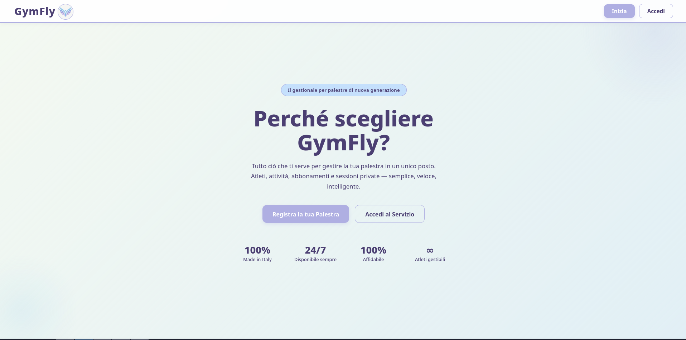
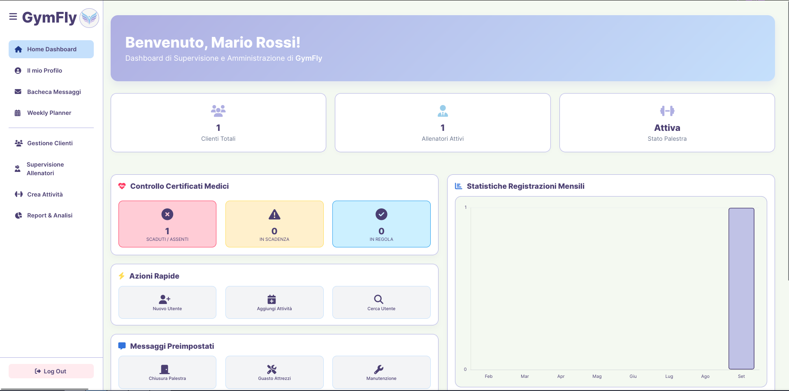
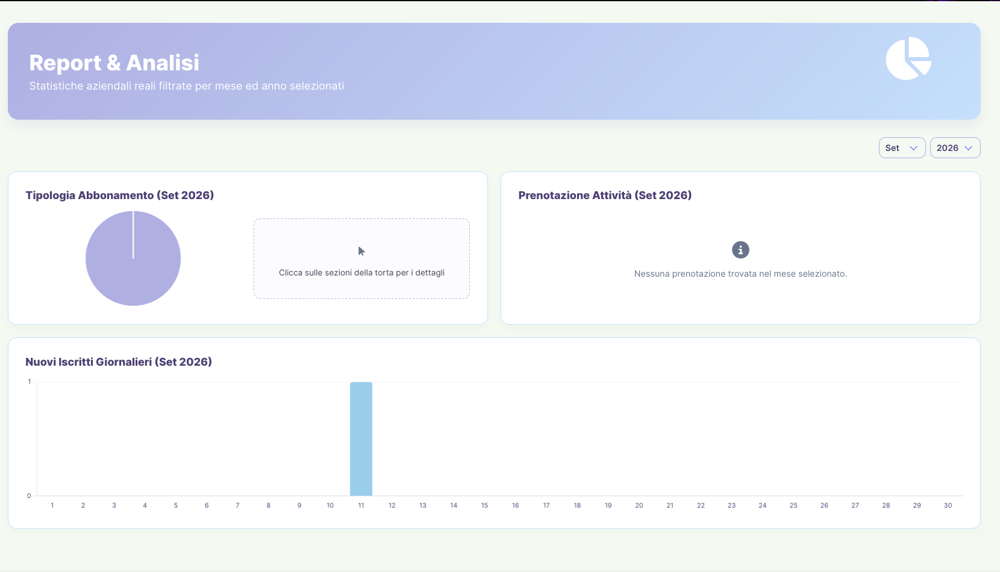
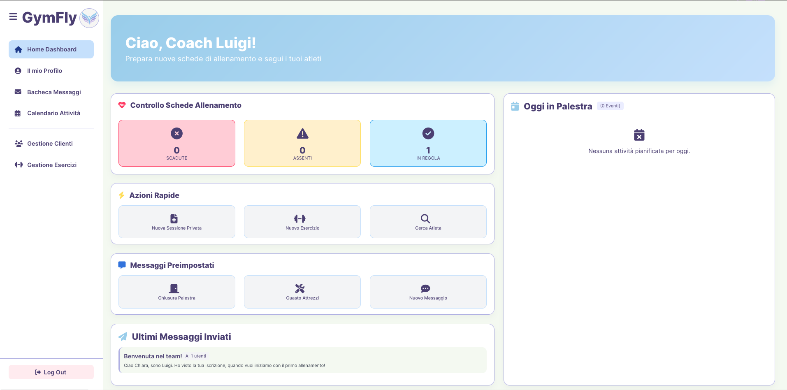
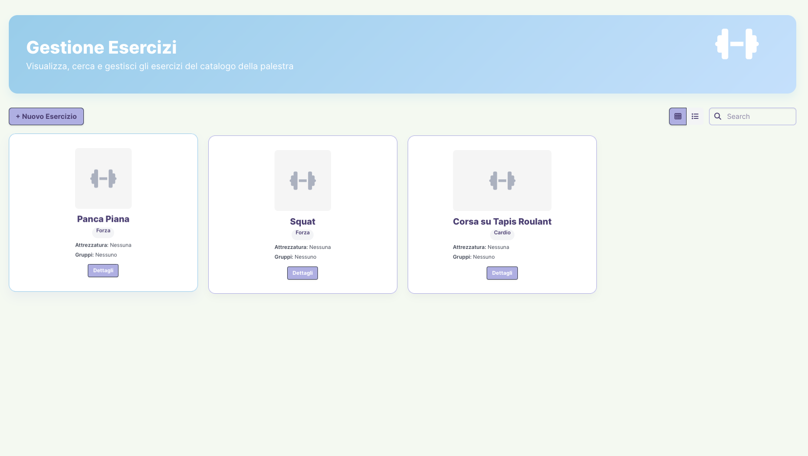
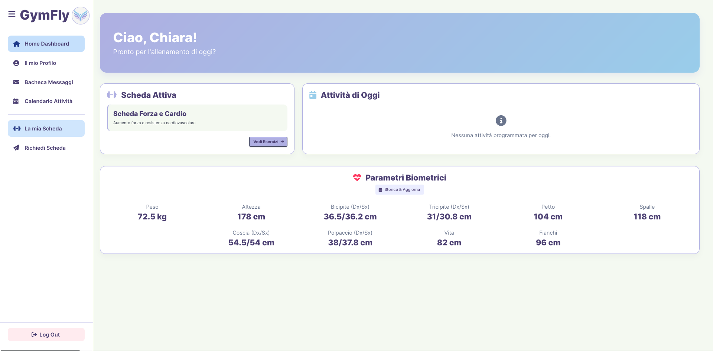

# GymFly

GymFly è un'applicazione web progettata per la gestione informatizzata e centralizzata di palestre. Il sistema è configurato per ospitare simultaneamente più strutture, mantenendo l'isolamento dei dati (utenti, schede, scadenze, ecc.) tra una palestra e l'altra.

L'architettura del sistema consente la condivisione dei dati in tempo reale tra l'amministratore, i personal trainer e i clienti di ogni singola struttura, garantendo un controllo preciso su anagrafica, scadenze e pianificazione delle attività. Il sistema è progettato per essere accessibile da più dispositivi (desktop e mobile).

   
  Pagina iniziale di benvenuto e accesso

---

## Architettura

GymFly prevede tre ruoli strutturati gerarchicamente. Il sistema implementa una politica di registrazione differenziata in base alla tipologia di utente.

> ⚠️ **Gestione delle Registrazioni**
> La registrazione autonoma (tramite form) è consentita **esclusivamente al ruolo Amministratore** per la creazione di una nuova palestra. 
> La creazione di nuovi account per Clienti e Allenatori non è libera: questi profili possono essere generati e associati **solo dall'Amministratore della specifica palestra**.

### 1. Amministratore (Titolare della singola palestra)
L'Amministratore è l'utente al vertice. Esegue la registrazione autonoma sulla piattaforma e ha il controllo completo sull'anagrafica e sui flussi gestionali della propria struttura.
* **Gestione Utenze (PT e Clienti):** Unico utente autorizzato alla registrazione, modifica e disattivazione dei profili dei propri clienti e allenatori.
* **Gestione Corsi:** Creazione e gestione di nuove attività e delle relative code di prenotazione. 
* **Controllo Abbonamenti:** Monitoraggio dello stato degli abbonamenti e delle relative scadenze.
* **Verifica Documentale:** Gestione e validazione delle date di scadenza dei certificati medici degli iscritti, necessaria per la conformità ai requisiti di idoneità sportiva.
* **Gestione Finanziaria:** Tracciamento dei flussi di cassa legati alle iscrizioni della propria struttura mediante grafici di vario tipo.
* **Messaggistica:** Possibilità di inviare comunicazioni a qualunque tipologia di utente.

<table align="center" width="100%">
  <tr>
    <td align="center" width="50%" style="padding: 8px;">
       
      Dashboard dell'amministratore
    </td>
    <td align="center" width="50%" style="padding: 8px;">
       
      Sezione di report e analisi dell'amministratore
    </td>
  </tr>
</table>

### 2. Allenatore
L'Allenatore utilizza il sistema per la programmazione delle attività e il monitoraggio biometrico dei clienti a lui assegnati.
* **Gestione Schede di Allenamento:** Creazione, modifica e assegnazione di schede tecniche personalizzate ai clienti.
* **Analisi dei Progressi:** Accesso allo storico delle misurazioni corporee e dei massimali registrati dai clienti.
* **Personalizzazione:** Adattamento dei programmi in base agli specifici obiettivi atletici del cliente.
* **Creazione di Sessioni Private:** L'allenatore può pianificare sessioni di allenamento individuali con i singoli clienti.
* **Messaggistica:** Possibilità di inviare comunicazioni dirette ai propri clienti.
* **Gestione Esercizi:** Possibilità di creare o eliminare esercizi da poter inserire nelle schede dei clienti.

<table align="center" width="100%">
  <tr>
    <td align="center" width="50%" style="padding: 8px;">
       
      Dashboard dell'allenatore
    </td>
    <td align="center" width="50%" style="padding: 8px;">
       
      Sezione per la gestione degli esercizi dell'allenatore
    </td>
  </tr>
</table>

### 3. Cliente
Il Cliente è l'utente finale del servizio associato a una determinata palestra.
* **Consultazione Schede:** Visualizzazione della propria scheda (richiedibile a un allenatore della palestra), con interfaccia ottimizzata per la consultazione da smartphone durante le sessioni in sala.
* **Monitoraggio Personale:** Verifica autonoma dello stato del proprio abbonamento e della validità del certificato medico.
* **Inserimento Metriche:** Modifica autonoma dei carichi sollevati, dei tempi e delle ripetizioni dei vari esercizi, e aggiornamento delle misurazioni corporee per il tracciamento dei progressi.
* **Iscrizione ad Attività Pianificate:** Prenotazione o disiscrizione ai corsi, con possibilità di iscrizione alle code di attesa nel caso in cui un determinato corso abbia raggiunto la massima capienza.
* **Messaggistica:** Visualizzazione di tutte le comunicazioni ricevute dallo staff.

   
  Dashboard del cliente

